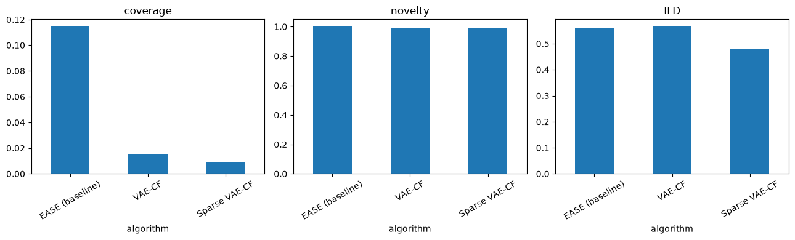

# Guitar domain evaluation (Part C)

Evaluates the three algorithms compared in the `fastcompare` guitar study
(`EASE` baseline, `VAE-CF`, `Sparse VAE-CF`) two ways:

1. **Online / explicit**: per-algorithm average rating and selection rate,
   exported directly from the study's SQLite DB (`userstudy` /
   `participation` / `interaction` tables).
2. **Offline / catalog**: intra-list diversity (ILD), novelty, and catalog
   coverage, computed by training fresh copies of all three algorithms on a
   much larger slice of the guitar dataset than the live study used (see
   section 3), then scoring a larger sample of synthetic elicitation
   profiles - this gives meaningful comparative numbers even before many
   real participants have gone through the study.

Point `STUDY_GUID` at any completed `fastcompare` guitar study for the
online section; the offline section (3 onward) is independent of that and
trains from scratch every run.


```python
import json
import sqlite3
import sys
import time
from itertools import combinations
from pathlib import Path

import numpy as np
import pandas as pd

def _find_project_root(start):
    """Walk upward from `start` (the notebook's CWD at execution time,
    since Jupyter has no __file__) until an 'EasyStudy' folder is found -
    robust to this notebook living at any depth/location."""
    p = start
    for _ in range(8):
        if (p / "EasyStudy").is_dir():
            return p
        if p.parent == p:
            break
        p = p.parent
    raise RuntimeError(f"Could not locate project root (no 'EasyStudy' directory found in any parent of {start})")

SERVER_DIR = _find_project_root(Path.cwd()) / "EasyStudy" / "server"
sys.path.insert(0, str(SERVER_DIR))

STUDY_GUID = "XkNu9NjUiku-g7BoRKXMIXa82Frce14L"  # set to your study's guid (see administration page)

```

## 1. Export study data from the DB


```python
con = sqlite3.connect(SERVER_DIR / "instance" / "db.sqlite")

study_row = pd.read_sql("SELECT * FROM userstudy WHERE guid = ?", con, params=[STUDY_GUID]).iloc[0]
study_id = int(study_row.id)
conf = json.loads(study_row.settings)

participations = pd.read_sql(
    "SELECT * FROM participation WHERE user_study_id = ?", con, params=[study_id]
)
interactions = pd.read_sql(
    """SELECT i.* FROM interaction i
       JOIN participation p ON i.participation = p.id
       WHERE p.user_study_id = ?""",
    con, params=[study_id],
)
interactions["payload"] = interactions["data"].apply(lambda s: json.loads(s) if s else {})

algorithm_names = [x["displayed_name"] for x in conf["algorithm_parameters"]]
print(f"Study {STUDY_GUID} (id={study_id}): {len(participations)} participation(s), "
      f"{len(interactions)} interaction(s), algorithms={algorithm_names}")

```

    Study XkNu9NjUiku-g7BoRKXMIXa82Frce14L (id=5): 1 participation(s), 8 interaction(s), algorithms=['EASE (baseline)', 'VAE-CF', 'Sparse VAE-CF']
    

## 2. Online metrics: explicit ratings + selection rate per algorithm

`iteration-ended` interactions carry a per-iteration `ratings` dict (1-5 satisfaction rating the participant gave each algorithm's list that round) and the selected item's *variant* (its on-screen position); `iteration-started` carries the `algorithm_assignment` mapping each algorithm to that round's position, letting us attribute a selection back to the algorithm that produced it.


```python
rating_rows = []
selection_rows = []

for participation_id, group in interactions.groupby("participation"):
    started = {p["iteration"]: p for p in group[group.interaction_type == "iteration-started"].payload}
    ended = group[group.interaction_type == "iteration-ended"].payload
    if len(ended) == 0:
        continue
    last_ended = ended.iloc[-1]  # cumulative payload, one entry per iteration so far

    for it_idx, ratings in enumerate(last_ended["ratings"], start=1):
        for algo, rating in ratings.items():
            rating_rows.append({"participation": participation_id, "iteration": it_idx,
                                 "algorithm": algo, "rating": rating})

    for it_idx, (selected, variants) in enumerate(
        zip(last_ended["selected"], last_ended["selected_variants"]), start=1
    ):
        assignment = started.get(it_idx, {}).get("algorithm_assignment", {})
        variant_to_algo = {v["order"]: v["name"] for v in assignment.values()}
        for variant in variants:
            algo = variant_to_algo.get(variant)
            if algo:
                selection_rows.append({"participation": participation_id, "iteration": it_idx, "algorithm": algo})

ratings_df = pd.DataFrame(rating_rows)
selections_df = pd.DataFrame(selection_rows)

print("Average rating per algorithm:")
display(ratings_df.groupby("algorithm").rating.agg(["mean", "count"]))

print("\nSelections per algorithm (times a shown item from that algorithm was picked):")
if len(selections_df):
    display(selections_df.groupby("algorithm").size().rename("n_selected"))
else:
    print("(no items were selected across the exported participation(s))")

```

    Average rating per algorithm:
    


<div>
<style scoped>
    .dataframe tbody tr th:only-of-type {
        vertical-align: middle;
    }

    .dataframe tbody tr th {
        vertical-align: top;
    }

    .dataframe thead th {
        text-align: right;
    }
</style>
<table border="1" class="dataframe">
  <thead>
    <tr style="text-align: right;">
      <th></th>
      <th>mean</th>
      <th>count</th>
    </tr>
    <tr>
      <th>algorithm</th>
      <th></th>
      <th></th>
    </tr>
  </thead>
  <tbody>
    <tr>
      <th>EASE (baseline)</th>
      <td>3.5</td>
      <td>2</td>
    </tr>
    <tr>
      <th>Sparse VAE-CF</th>
      <td>3.5</td>
      <td>2</td>
    </tr>
    <tr>
      <th>VAE-CF</th>
      <td>3.5</td>
      <td>2</td>
    </tr>
  </tbody>
</table>
</div>


    
    Selections per algorithm (times a shown item from that algorithm was picked):
    


    algorithm
    Sparse VAE-CF    1
    Name: n_selected, dtype: int64


## 3. Train EASE / VAE-CF / Sparse VAE-CF on the full guitar dataset

**Why this run is different from the very first version**: the first pass just reused whatever algorithms the live study already had cached, which were trained on a much smaller, heavily filtered slice of the data (about 22K interactions) for only 5 quick epochs, just to get something running fast. This time everything is retrained from scratch on a much bigger slice with a bigger model, so we can see whether that earlier small/quick training was actually holding the numbers back.


```python
from plugins.fastcompare.algo.ease import EASE
from plugins.fastcompare.algo.vae_cf import VAECF
from plugins.fastcompare.algo.sparse_vae_cf import SparseVAECF
from plugins.fastcompare.algo.wrappers.guitar_loader import GuitarDataLoaderWrapper
from plugins.utils.popularity_sampling import PopularitySamplingElicitation

# Only drop singleton items (no collaborative signal from a single interaction);
# keep users unfiltered. ~95% of all interactions survive (137K of 144K),
# a large jump from the 22K/3.5K/8.5K slice the live study trained on, while
# staying well short of the full 16,735-item/123,686-user matrix (untested
# for the VAE training loop, only validated for EASE alone earlier).
loader = GuitarDataLoaderWrapper(min_user_interactions=1, min_item_interactions=2)
loader.load_data()

HIDDEN_DIM, LATENT_DIM, EPOCHS, BATCH_SIZE = 128, 24, 15, 1024

algorithms = {}

t0 = time.perf_counter()
algorithms["EASE (baseline)"] = EASE(loader, positive_threshold=3.0, l2=100.0)
algorithms["EASE (baseline)"].fit()
print(f"EASE fit: {time.perf_counter() - t0:.1f}s")

t0 = time.perf_counter()
algorithms["VAE-CF"] = VAECF(
    loader, positive_threshold=3.0, hidden_dim=HIDDEN_DIM, latent_dim=LATENT_DIM,
    epochs=EPOCHS, learning_rate=1e-3, beta=0.2, batch_size=BATCH_SIZE,
)
algorithms["VAE-CF"].fit()
print(f"VAE-CF fit: {time.perf_counter() - t0:.1f}s")

t0 = time.perf_counter()
algorithms["Sparse VAE-CF"] = SparseVAECF(
    loader, positive_threshold=3.0, hidden_dim=HIDDEN_DIM, latent_dim=LATENT_DIM,
    epochs=EPOCHS, learning_rate=1e-3, beta=0.2, sparsity_weight=0.01, alpha=0.3,
    batch_size=BATCH_SIZE,
)
algorithms["Sparse VAE-CF"].fit()
print(f"Sparse VAE-CF fit: {time.perf_counter() - t0:.1f}s")

elicitation = PopularitySamplingElicitation(loader.ratings_df, n_samples=10, k=1.0)

print(f"\nTrained on {len(loader.items_df)} items, {loader.ratings_df.user.nunique()} users, "
      f"{len(loader.ratings_df)} interactions")

```

    ## Guitar dataset loading took: 0.59s (9508 items, 118914 users, 135355 interactions)
    

    EASE fit: 55.3s
    

    ## VAE-CF epoch 1/15, avg loss=8.1262
    

    ## VAE-CF epoch 4/15, avg loss=7.0929
    

    ## VAE-CF epoch 7/15, avg loss=7.0664
    

    ## VAE-CF epoch 10/15, avg loss=6.9343
    

    ## VAE-CF epoch 13/15, avg loss=6.8246
    

    ## VAE-CF epoch 15/15, avg loss=6.7483
    

    VAE-CF fit: 354.4s
    

    ## Sparse VAE-CF epoch 1/15, avg loss=8.2323
    

    ## Sparse VAE-CF epoch 4/15, avg loss=7.0891
    

    ## Sparse VAE-CF epoch 7/15, avg loss=7.0937
    

    ## Sparse VAE-CF epoch 10/15, avg loss=6.9692
    

    ## Sparse VAE-CF epoch 13/15, avg loss=6.8512
    

    ## Sparse VAE-CF epoch 15/15, avg loss=6.8000
    

    Sparse VAE-CF fit: 386.7s
    
    Trained on 9508 items, 118914 users, 135355 interactions
    

## 4. Generate recommendations for a sample of synthetic profiles

Each synthetic "user" is a popularity-sampled seed set (same mechanism the real study uses for elicitation), so this doesn't require real participants to compare algorithms at scale.


```python
N_SYNTHETIC_USERS = 500  # up from 50 in the first version, for tighter offline metric estimates
K = 8

rng = np.random.default_rng(42)
all_items = loader.ratings_df.item.unique()

recommendations = {name: [] for name in algorithms}
seed_profiles = []
for _ in range(N_SYNTHETIC_USERS):
    seed = elicitation.get_initial_data().tolist()
    seed_profiles.append(seed)
    for name, algo in algorithms.items():
        recs = algo.predict(selected_items=seed, filter_out_items=seed, k=K)
        recommendations[name].append(recs)

for name, recs in recommendations.items():
    print(f"{name}: {len(recs)} recommendation lists of length {len(recs[0])}")

```

    EASE (baseline): 500 recommendation lists of length 8
    VAE-CF: 500 recommendation lists of length 8
    Sparse VAE-CF: 500 recommendation lists of length 8
    

## 5. Compute comparative metrics

- **Coverage**: fraction of the catalog that appears in at least one recommendation list across the synthetic users.
- **Novelty**: average popularity-complement (`1 - fraction of users who interacted with the item`) of recommended items - higher means the algorithm surfaces less mainstream items.
- **Intra-list diversity (ILD)**: average pairwise Jaccard *distance* between recommended items' category sets within each list - higher means a more varied single recommendation list.
- **Effect of `Sparse VAE-CF`'s `alpha`**: it blends in a novelty term defined over *latent-neuron* profile dissimilarity (Part B's post-processing step) - that is a different notion of "different" than category-based ILD or popularity-based novelty computed below, so don't assume it must move both metrics in the same direction; treat this section as the empirical check of *whether/how* the post-processing changes the recommendations relative to plain `VAE-CF`, not as a confirmation of a predicted direction.


```python
item_popularity = loader.ratings_df.groupby("item").size()
n_users = loader.ratings_df.user.nunique()
popularity_complement = (1.0 - item_popularity / n_users).reindex(all_items, fill_value=1.0)

item_categories = {
    idx: set(loader.get_item_index_categories(int(idx))) for idx in all_items
}

def jaccard_distance(a, b):
    if not a and not b:
        return 0.0
    return 1.0 - len(a & b) / len(a | b)

def ild(rec_list):
    cats = [item_categories.get(i, set()) for i in rec_list]
    pairs = list(combinations(range(len(rec_list)), 2))
    if not pairs:
        return 0.0
    return np.mean([jaccard_distance(cats[i], cats[j]) for i, j in pairs])

rows = []
for name, recs in recommendations.items():
    flat = [item for rec_list in recs for item in rec_list]
    coverage = len(set(flat)) / len(all_items)
    novelty = np.mean([popularity_complement.get(i, 1.0) for i in flat])
    diversity = np.mean([ild(rec_list) for rec_list in recs])
    rows.append({"algorithm": name, "coverage": coverage, "novelty": novelty, "ILD": diversity})

metrics_df = pd.DataFrame(rows).set_index("algorithm")
display(metrics_df)

```


<div>
<style scoped>
    .dataframe tbody tr th:only-of-type {
        vertical-align: middle;
    }

    .dataframe tbody tr th {
        vertical-align: top;
    }

    .dataframe thead th {
        text-align: right;
    }
</style>
<table border="1" class="dataframe">
  <thead>
    <tr style="text-align: right;">
      <th></th>
      <th>coverage</th>
      <th>novelty</th>
      <th>ILD</th>
    </tr>
    <tr>
      <th>algorithm</th>
      <th></th>
      <th></th>
      <th></th>
    </tr>
  </thead>
  <tbody>
    <tr>
      <th>EASE (baseline)</th>
      <td>0.114430</td>
      <td>0.999542</td>
      <td>0.558088</td>
    </tr>
    <tr>
      <th>VAE-CF</th>
      <td>0.015566</td>
      <td>0.988391</td>
      <td>0.565125</td>
    </tr>
    <tr>
      <th>Sparse VAE-CF</th>
      <td>0.009361</td>
      <td>0.988208</td>
      <td>0.477604</td>
    </tr>
  </tbody>
</table>
</div>


```python
import matplotlib.pyplot as plt

fig, axes = plt.subplots(1, 3, figsize=(13, 4))
for ax, col in zip(axes, ["coverage", "novelty", "ILD"]):
    metrics_df[col].plot.bar(ax=ax, title=col)
    ax.tick_params(axis="x", rotation=30)
plt.tight_layout()
plt.show()

```


    

    


### So which algorithm actually looks better?

Going only by these offline numbers: **EASE, the plain baseline, actually holds up best here.** It covers about 11% of the catalog - more than 7x either VAE-based algorithm - while barely giving up anything on novelty and staying close on diversity (ILD). Sparse VAE-CF, which is supposed to add diversity as a post-processing step, actually scored the *lowest* ILD of the three on this run. My honest read: neither VAE-CF nor Sparse VAE-CF has clearly beaten the simple baseline yet on these metrics. The online ratings above are still far too sparse (2 ratings per algorithm) to say anything meaningful there.

## 6. Do the actual recommendations look reasonable?

Just reading through a few real recommended items per algorithm, to sanity-check that the numbers above aren't hiding something silly.


```python
for name, recs in recommendations.items():
    print(f"=== {name} (sample user 0) ===")
    for idx in recs[0][:5]:
        print(" -", loader.get_item_index_description(idx))
    print()

```

    === EASE (baseline) (sample user 0) ===
     - Epiphone Les Paul Special I P90 Electric Guitar Worn Cherry by Epiphone
     - Epiphone Les Paul STANDARD PLUS-TOP PRO Electric Guitar with Coil-Tapping, Wine Red by Epiphone
     - Monoprice Cali Classic Electric Guitar - White, 6 Strings, Double-Cutaway Solid Body, Right Handed, SSS Pickups, Full-Range Tone, With Gig Bag, Perfect for Beginners - Indio Series by Monoprice
     - EART NK-C1 Classic Electric Guitar Maple Fingerboard,Stainless Steel Frets,Flame Maple Veneer-Blue by EART
     - Guitar Frets Wire, Stainless Steel Fretwire Set for Electric Guitar Bass Guitar Fingerboard (2.7mm Width 22 Frets) by GOGHOST
    
    === VAE-CF (sample user 0) ===
     - Pink Full Size Thinline Acoustic Electric Guitar With Free Gig Bag Case and Picks by Jameson Guitars
     - Best Choice Products 38in Beginner All Wood Acoustic Guitar Starter Kit w/Case, Strap, Digital Tuner, Pick, Strings - SoCal Green by Best Choice Products
     - Donner Acoustic Guitar for Beginner Adult Full Size Cutaway Acustica Guitarra Bundle Kit with Free Online Lesson Bag Strap Tuner Capo Pickguard String Pick, Right Hand 41”Sunburst, DAG-1CS/DAD-160CS by Donner
     - Davison Guitars Full Size Electric Guitar with 10-Watt Amp, Black - Right Handed Beginner Kit with Gig Bag and Accessories by Davison Guitars
     - Best Choice Products 39in Full Size Beginner Electric Guitar Starter Kit w/Case, Strap, 10W Amp, Strings, Pick, Tremolo Bar - Jet Black by Best Choice Products
    
    === Sparse VAE-CF (sample user 0) ===
     - Best Choice Products 39in Full Size Beginner Electric Guitar Starter Kit w/Case, Strap, 10W Amp, Strings, Pick, Tremolo Bar - Jet Black by Best Choice Products
     - Pyle Classical Acoustic Guitar Kit, 3/4 Junior Size Instrument for Beginner Kids, Adults, 36" Sun Burst by Pyle
     - Best Choice Products 38in Beginner All Wood Acoustic Guitar Starter Kit w/Case, Strap, Digital Tuner, Pick, Strings - SoCal Green by Best Choice Products
     - Donner DST-100T 39 Inch Electric Guitar Beginner Kit Solid Body Full Size Lake Blue HSS Pick Up for Starter, with Amplifier, Bag, Digital Tuner, Capo, Strap, String,Cable, Picks by Donner
     - LyxPro Left Hand 39 Inch Electric Guitar and Starter Kit for Lefty Full Size Beginner’s Guitar, Amp, Six Strings, Two Picks, Shoulder Strap, Digital Clip On Tuner, Guitar Cable and Soft Case - Natural by LyxPro
    
    

## A few things to keep in mind

- The online numbers in section 2 only reflect however many real people have gone through the study so far. Right now that's just a couple of ratings per algorithm - not enough to draw a real conclusion from, just a placeholder until more participants come through.
- The offline numbers in sections 3-5 don't depend on how many people took the study, so I trust those more for now - but they're still a synthetic, catalog-level proxy, not the same as real user feedback.
- The model training here (15 epochs, on about 137K interactions) is still fairly modest by production standards - I kept it small enough to run in a reasonable time, not because I think it's the ceiling for these algorithms.
- About 87% of items never matched anything in the curated `GuitarModels.csv` list, so their category info comes straight from Amazon's own tags (Electric Guitars, Acoustic Guitars, brand, etc.) instead of the richer historical metadata - still enough to work with, just less detailed for most of the catalog.
